# 健康护航保盾管理系统

## 项目简介

本软件是基于 Vue 和 Spring Boot 的健康护航保盾管理系统，是一个经典的前后端分离的项目。

系统主要包含系统配置维护、系统参保管理、大病保险管理、大病登记管理、保险审核管理这五大模块。

## 项目背景

2020 年 1 月，国家医疗相关部门联合下发文件，引导新农合大病保险工作的实施与展开，文章中指出何为大病保险，而且明确的表达了大病保险是基于基本医保的扩展保障。医疗保险的这种补偿性，在多年的医疗卫生体制的深化改革下，城乡居民大病保险已经给无数的城乡居民带来了福音，一套有力的基础制度逐渐成熟，对小康社会的出现和和谐社会的构建有着非同小可的意义；使得“因病返贫，因病致贫”的社会痛点得以解决。城乡居民大病保险工作业务的开展，将会减少自身患有重大疾病的城乡居民所指出的高额医疗费用，居民生活条件得以改善。

## 项目架构

这个系统用于对大病患者的手术费用进行保险报销，模拟了参保人员就医后费用报销的流程，对参保人员进行存档管理，对病人就医后的费用和报销比例自动核算，对社保卡的余额自助充值，将报销数据自动转发给保险公司审核。

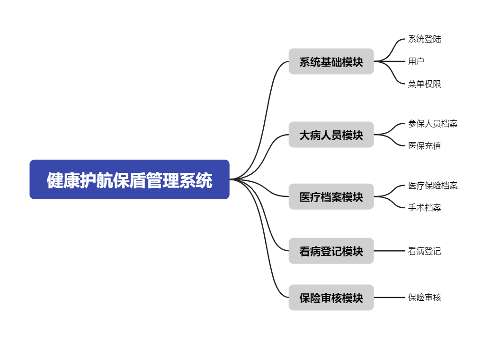

系统运行的流程，是大病患者有医保卡，医保卡里有钱，病人可以拿着医保卡去医院就医；其中自费部分直接扣卡里的钱，医保报销部分由医院垫付；垫付部分由保险公司审核通过后，医保报销部分再转给医院，如果不通过，再扣医保卡里的余额。

本系统使用对象有三个，分别是医院医生、保险公司以及系统管理员。

-   医院医生：主要负责对 就医患者进行看病登记
-   保险公司：主要负责发布医保信息、维护参保人员档案，设置各类手术的报销比例、医保报销审核
-   系统管理员：主要负责医保卡充值、对医院医生和保险公司业务员的登入账号、角色、权限进行配置，系统操作日志、维护数据字典

## 项目技术栈

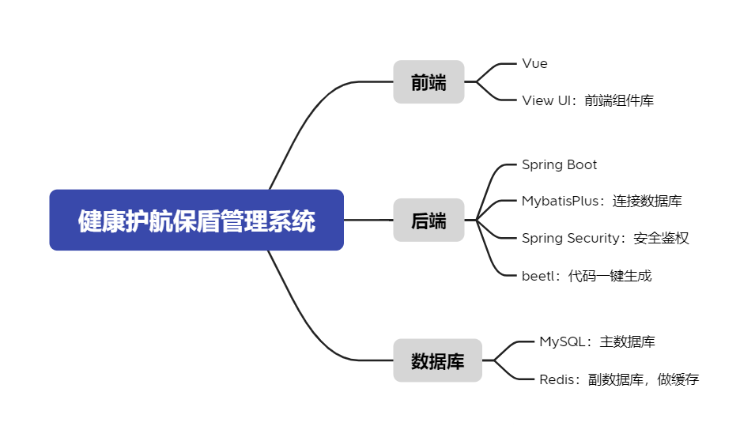

## 一般约束

1.  开发环境约束：
    -   开发工具：前端 VSCode，后端 IntelliJ IDEA，数据库 MySQL 和 Redis
    -   开发语言：Java、JavaScript、HTML5、CSS3、Vue.js
    -   使用的框架：前端 View UI 组件库，后端 Spring Boot、 MyBatisPlus 和 Spring Security
2.  时间约束：项目开发周期为 3 个星期，需要开发者合理规划时间。
3.  技术约束：JDK 17 、MySQL 8 。
4.  其他约束：开发者需在完成项目需求的前提下，考虑编码规范、页面优化等因素。

## 详细功能说明

### 系统基础模块

系统基础模块包括登入用户、角色权限、系统菜单、数据字典等功能，主要功能为对系统的登入账户的信息维护。管理员可以根据需要对各个部分进行编辑。系统的用户管理模块负责维护系统登入用户的删改，前端将操作的数据通过 ajax 发送到后端的控制器层，后逐层深入操作底层数据库，再将返回结果给视图层渲染。管理员可以在该模块中对用户进行日常的维护工作。对于登入用户管理功能，管理员可以对用户的信息进行编辑、删除、禁用等操作；对于角色权限管理，管理员可以根据用户，选择对该用户进行添加或是删除某项权限。

#### 用户登陆和注册

进入系统，首先看到登录界面，用户可以输入自己的账号、密码，进行登入操作。

如果没有账号，可以进行注册，下面是注册的页面。

用户需要填写手机号、用户姓名、密码和验证码进行账号注册，默认注册的用户角色为普通用户，注册完成之后，该用户信息将保存的MySQL数据库中，然后用户可以点击返回登录按钮进入登录页面。

登陆页面包含账号密码和企业微信两个选择来进行登录。输入账号、密码和验证码后点击登陆，即可登陆系统，此处账号密码不能为空，如果密码输入错误，系统将进行密码错误提示，不能登陆系统，如果验证码过期，则需要重新获取验证。登陆鉴权功能由后端完成。

#### 系统首页

登入成功后，进入到系统的首页，顶部是系统的标题栏，用于显示系统“护航保盾”的图标和一级菜单，左侧是二级、三级菜单栏，用于存放用户拥有权限的菜单列表，右下角为主区域，首页有系统名称，时间显示，常用模块，代办模块，点击对应的常用模块，可以跳转到对应用的模块进行操作。

#### 系统锁定

点击系统顶部的小锁可以对系统进行锁定，用户需要输入登录密码才能再次进入系统。

#### 用户角色

**此系统用于三类人群进行登陆和使用，分别是管理员、医生、保险审核员。**

首先是管理员，对医保卡进行充值、对医院医生和保险公司业务员的账号、角色、权限进行配置是他的主要职责。此外可以操作日志，对数据字典进行维护；医院医生最主要职责就是对就医的患者进行看病登记；保险审核员则是发布医保信息，对参保人员的档案进行维护，各类手术的报销比例由他们来规定，以及医保报销审核通过与否由审核员决定。

**管理员**

使用管理员账号成功登入系统后，可以使用本系统的全部功能。

**用户管理模块**。该模块使用了 View UI 的 Table 组件，和 Form 组件作为搜索栏。默认显示20条用户信息。

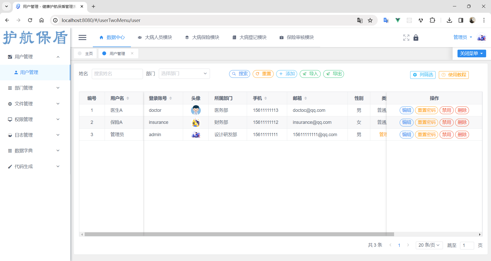

**搜索用户**

用户可以根据“姓名”,“部门”，或者“姓名 + 部门”的方式对所有账号进行搜索。如果存在搜索的用户存在则显示用户信息，否则显示暂无数据。当用户点击“重置”按钮之后，可以重置搜索条件。

搜索存在的用户
>
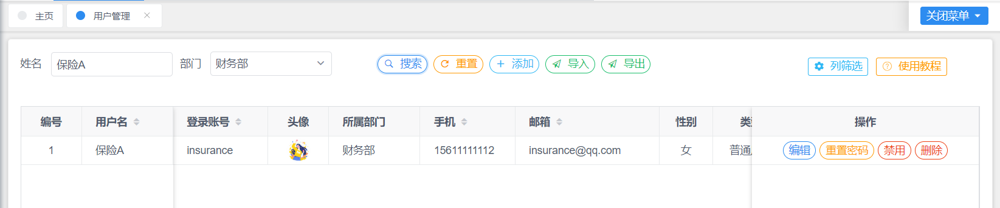
>
搜索不存在的用户
>

**添加用户**

用户点击 “添加”按钮后，会弹出一个弹窗编辑框，填写对应的信息点击提交之后，会增加一个账号。

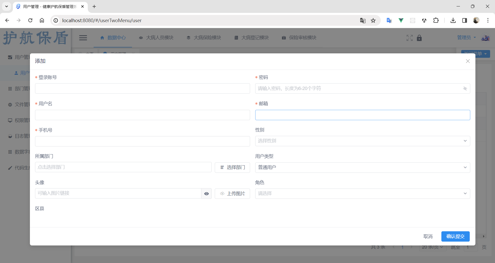

**批量添加用户**

用户点击“导入”按钮后，在弹窗中上传 Excel 文件，可以进行账号的批量添加，添加弹窗使用了 View UI 的 Drawer 抽屉组件。

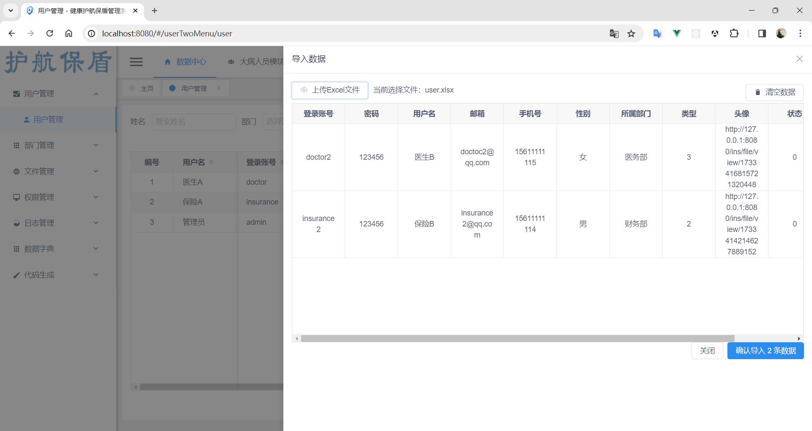

**更改用户信息**

用户点击“编辑”按钮的时候，会弹出一个表格，可以对选中的账号的信息进行修改。

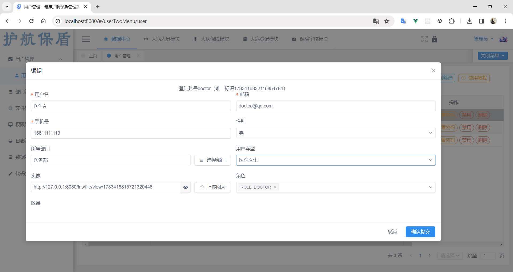

**重置密码**

用户点击“重置”按钮，可以将选中的账号密码重置为 123456，确认弹窗使用了 View UI 的 Modal 组件。

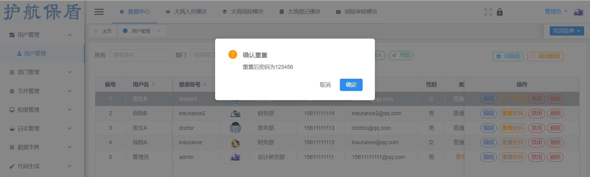

**启用/禁用用户**

点击每一行的“启用”/“禁用”按钮，可以对用户信息进行启用/禁用，确认弹窗使用了 View UI 的 Modal 组件。

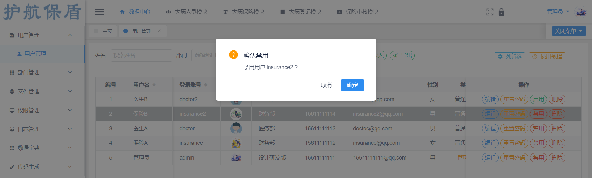

#### 角色权限

该系统用于三类人群进行登录和使用，分别是管理员，医生，保险审核员。管理员具体添加角色的功能，可以对某一角色进行添加或者是删除某项权限。用户可以根据“角色名称”或者“角色描述”进行模糊搜索。

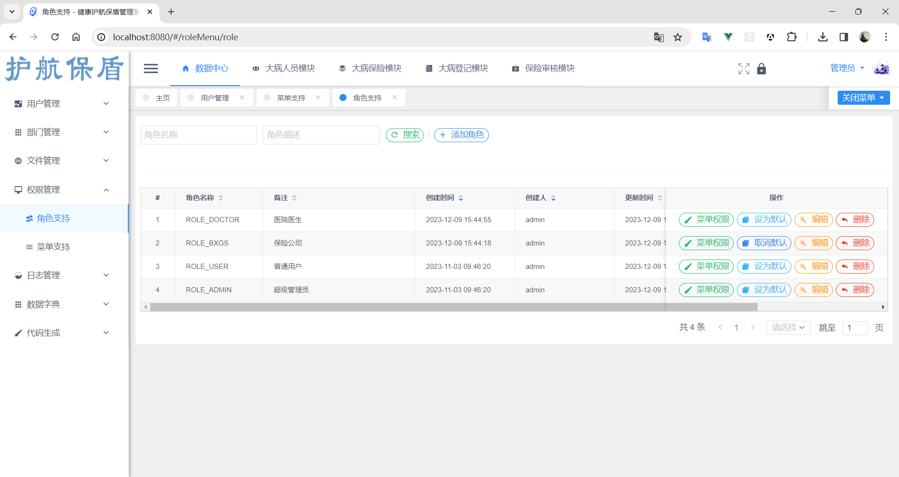

管理员具有添加角色的权限，点击 “添加角色”可以创建一个新的角色。

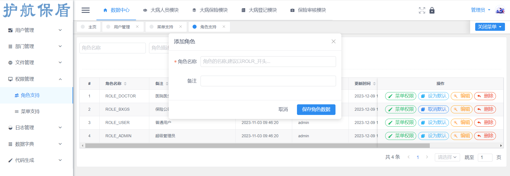

角色创建完成之后，管理员可以将该角色添设置为默认注册用户，也可以对该角色进行编辑、删除等操作。

#### 菜单权限

系统采用基于角色的访问控制，即用户和菜单不直接做匹配，由角色和菜单、角色和用户做关联。管理员可以点击每一行的“菜单权限”按钮，完成对角色的菜单权限分配。分配页面使用了 View UI 的 Tree 树形控件，对不同层级的菜单进行了渲染。

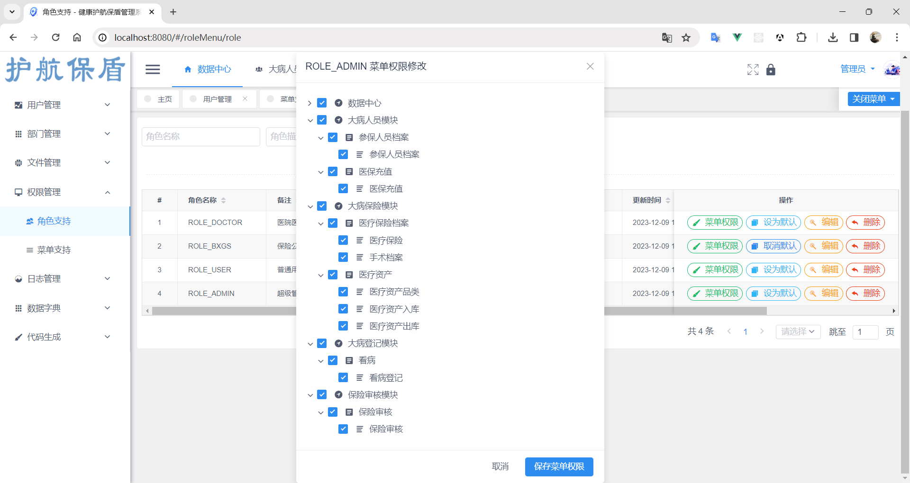

管理员还可以根据具体情况，添加新的一级菜单、二级菜单、三级菜单。

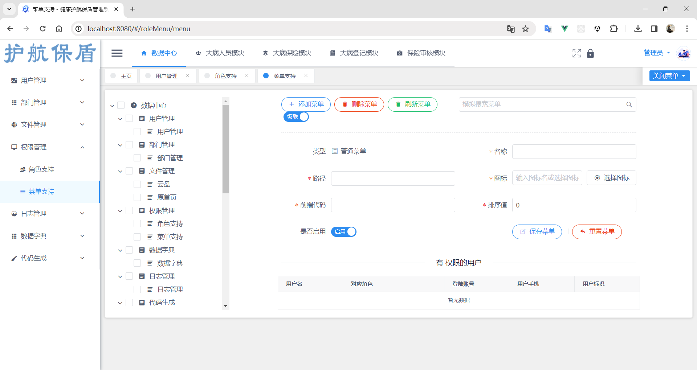

#### 日志管理

管理员可以查看用户登录的日志，用户操作数据中心的日志，包括请求类型，请求路径，请求参数等。

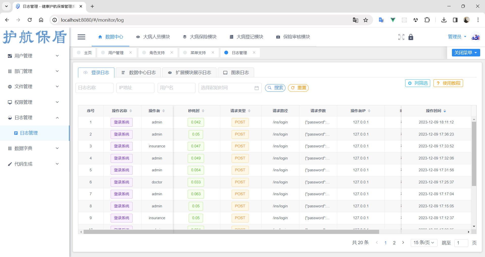

### 大病人员模块

#### 参保人员档案

参保人员档案包含了参保人员的信息，其中中间区域上部分含有添加、搜索、筛选功能按钮，下方显示参保人员的相关医保信息，下侧窗口为参保人员详细信息，点击参保人员，会将该参保人员的基础信息、社保情况、参保情况显示在该中间区域的下方，可对这些进行信息进行修改，包括基础信息的修改，社保情况的修改，参保情况的修改。

模块下侧的详情界面，使用了 View UI 的 Tabs 标签页组件，可自由进行切换，通过 Vue 条件渲染完成。

**参保人员信息**

医院医生具有该模块的使用权限，进入该模块，显示的是参保的人员，可以对参保人员其进行搜索，筛选等功能。

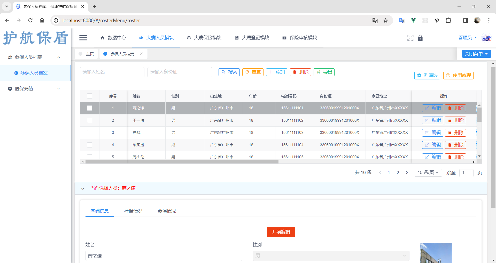

选中参保人员之后，在下方会显示该参保人员参保的基础信息、社保信息、参保情况。

基础信息
>
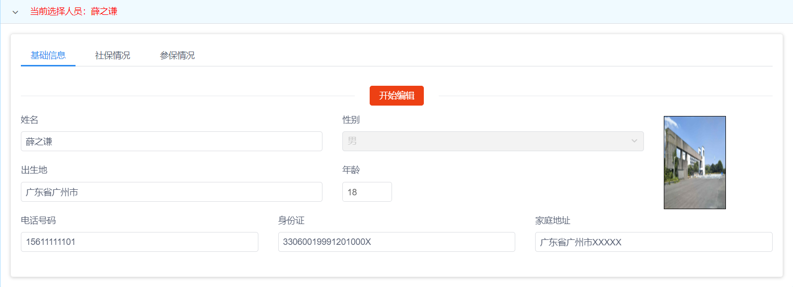
>
社保信息
>
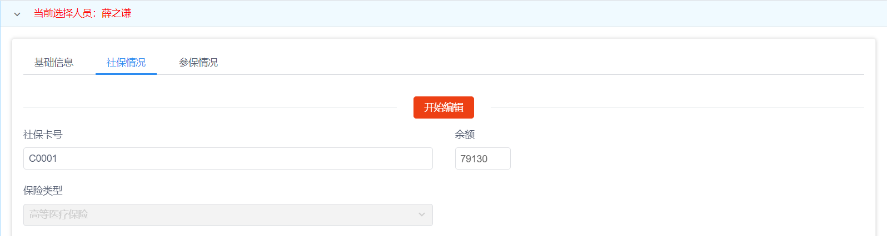
>
参保情况
>

点击“添加”，则可以录入大病患者的基础信息，包括姓名、手机号、身份证号码、社保卡号、家庭住址、以及保险类型。然后点击“提交”则可以进行参保人员信息的录入操作。

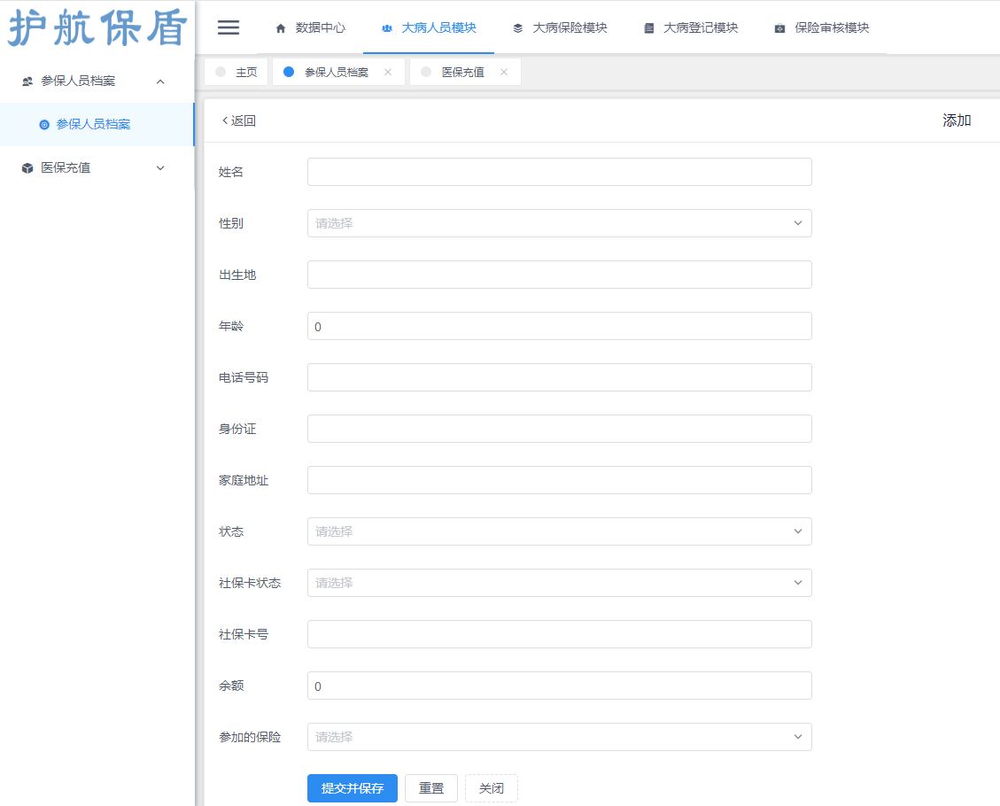

#### 医保充值

医保充值界面中，同样包含了参保人的一些基本信息，如姓名、电话、身份证、社保卡及余额等，管理人员可以点击右侧的充值按钮给参保人员进行充值。

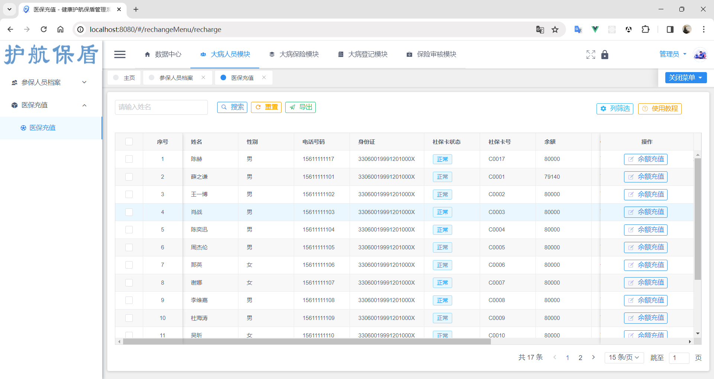

管理员可以点击每一行的充值按钮，完成医保卡的充值操作。 下面是模拟医保充值模块的实现，以上步骤已经实现参保人员信息录入操作，但是医保卡里没有钱，无法进行看病报销。所以需要进行医保充值。选择需要充值的社保卡，点击后方“余额充值”按钮，弹出“余额充值”的框，输入充值价格就可以了。

充值金额的输入框采用了 View UI 的 InputNumber 数字输入框，充值的金额会累加到原来的余额上。

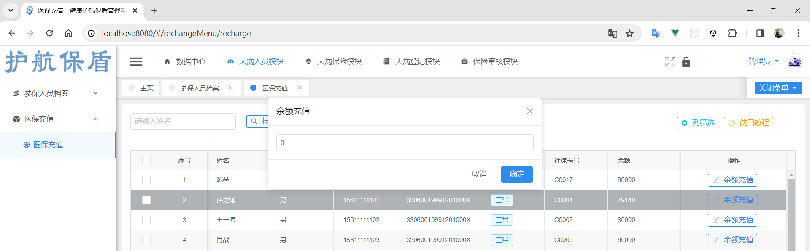

### 医疗档案模块

#### 医疗保险档案

大病保险模块是对保险手术相关的信息修改，所以该部分功能包括了医疗保险信息的修改和手术档案信息的修改。包括了最基本的对医疗保险信息和手术档案的增删改查，首先点击左侧的医疗保险或者手术档案即可链接到相应的界面，然后对相应的信息进行修改，例如如下图所示，当前页面为医疗保险的信息，在这个页面可以对医疗保险的信息继续修改，点击添加按钮即可添加医疗保险，登记保险名称，分类门诊百分比等，这些医疗保险信息分别都与后续其他模块如大病登记或是保险审核相干，这些信息都会影响到其他模块。手术档案部分同医疗保险部分的功能大体上相同，也包含相应的添加、搜索、编辑等，这里的设置同样能够影响到后续其它模块，这里的主要功能是对手术级别以及手术费用的设置，这样便于与医疗保险的等级对应起来。

其中，保险名称有三种，分别是最抵档疗保险、中等医疗保险、高等医疗保险，ABC 三类大病门诊百分比也不同。保险审核员可以对其进行编辑和删除。此模块是医保管理员进行操作的。

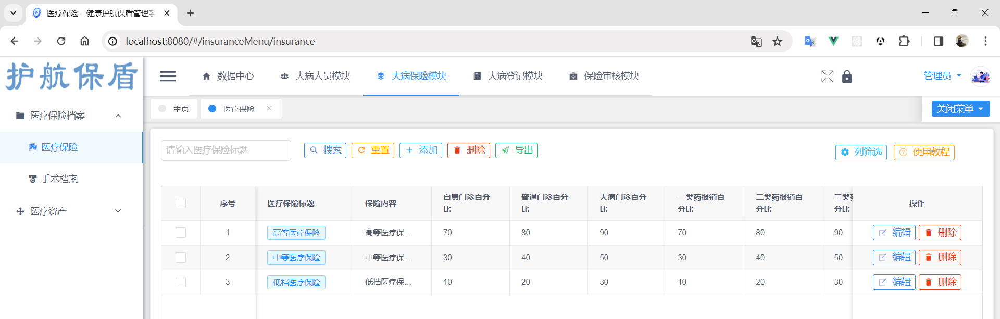

**添加新的医疗保险**

保险人员可以点击“添加”按钮，新增新的医疗保险，根据具体的保险设置百分比。也可以点击编辑按钮对保险进行修改。

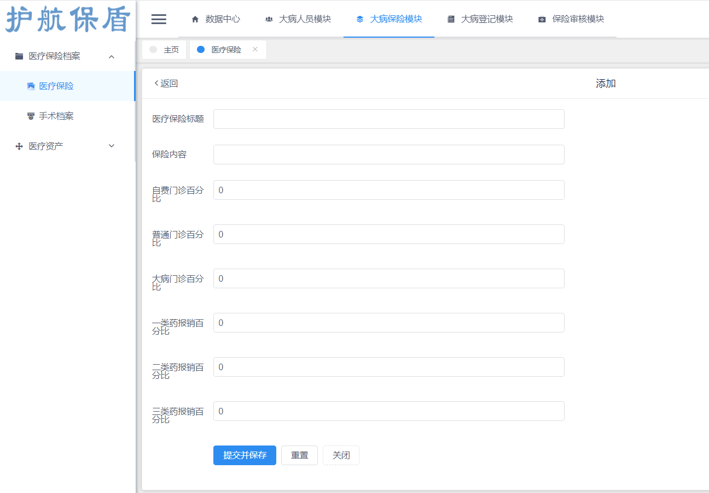

#### 手术档案

此外还有手术档案小模块，包括手术名称，手术价格，功能主治的介绍，以及手术类型，例如关节穿刺术，手术价格为 6750 元，对人体关键骨节进行复位的穿刺，属于一级手术。

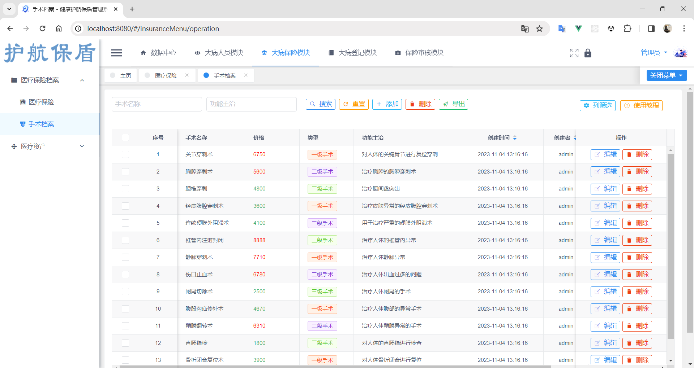

医院医生可以添加新的的手术，编辑和删除手术。

#### 医疗资产管理

该模块针对医院的流动资产、固定资产和无形资产等进行管理登记，以实现资产的保值和运行效率的提升。该模块有三个功能，分别是医疗资产品类登记，医疗资产入库登记，医疗资产出库登记。

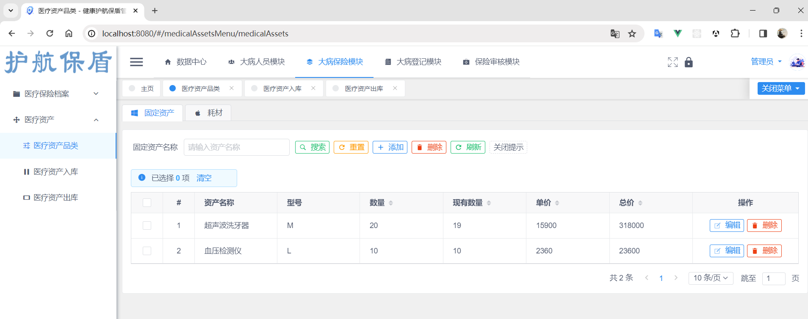

### 看病登记模块

大病登记模块包含了参保人员看病时的具体信息，该部分可帮助医疗相关工作者查看查找相关参保人员的就医信息，包括门诊的类型、费用总计以及看病的日期。如下图所示，当前页面为看病登记的信息，在这个页面可以对参保人员的就医信息进行查看，该模块也可对数据进行增删查功能，在查找部分，管理员可根据门诊的类型来选择患者查看患者。该模块可点击查看按钮即可进行更加详细的查看，例如手术类型，诊断费用，费用抵扣等。

进入看病登记模块，显示的是所有看病的用户，有看病日期，费用，创建时间的简略的信息。

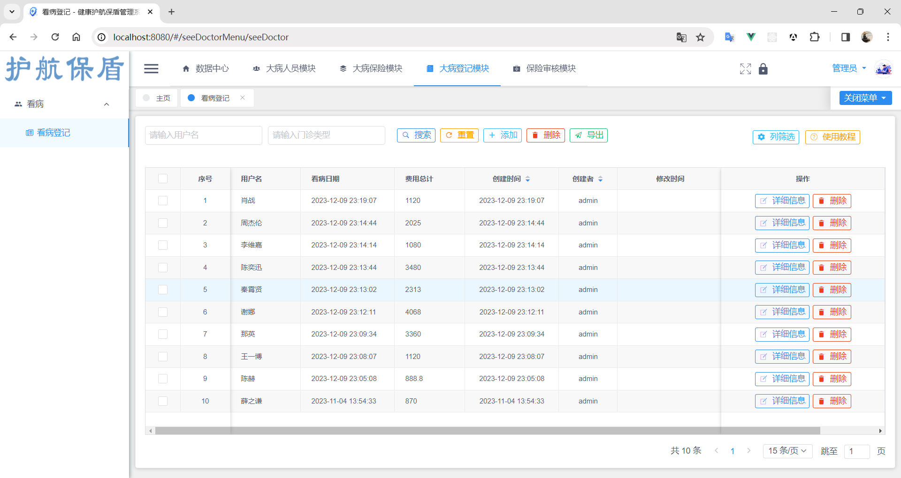

点击“详细信息”按钮可以查看具体的信息包括门诊的类型、费用总计以及看病的日期，诊断原价，诊断费用，诊断抵扣等。

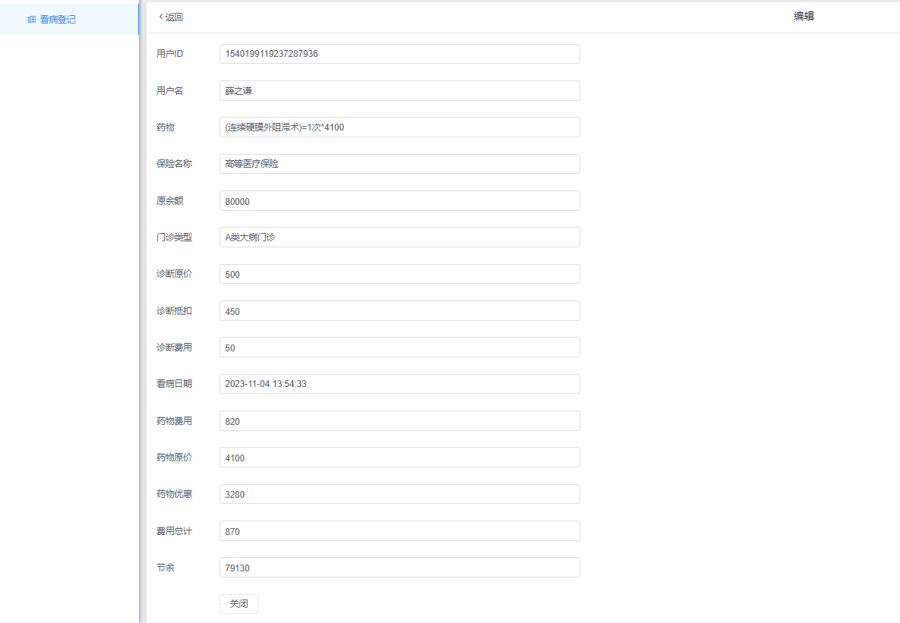

点击“添加”的按钮，可以为患者添加就医信息，弹出界面，如下图所示，选择“患者”、 “手术”以及“门诊类型”和“诊断原价”来进行添加。剩下的信息会自动带出，自动结算报销后的价格。患者信息来源自参保人员模块，通过打开 View UI 的 Drawer 抽屉控件完成选择。

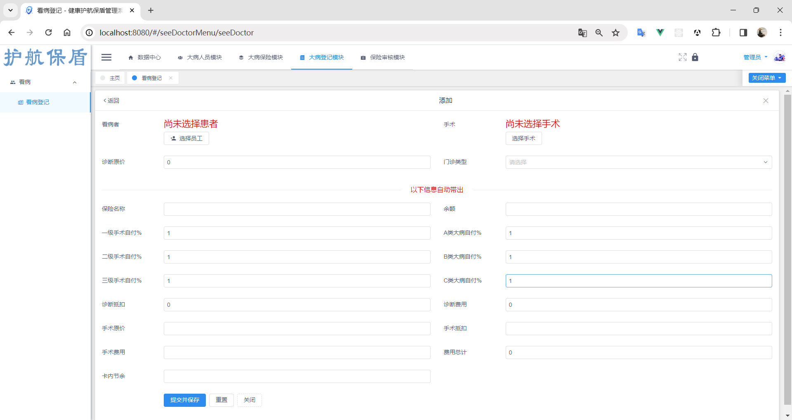

点击选择“选择患者”，弹出如下界面，该界面包含了参保人员的信息，包括姓名，联系电话，身份证号以及相关社保等信息，双击完成选择。

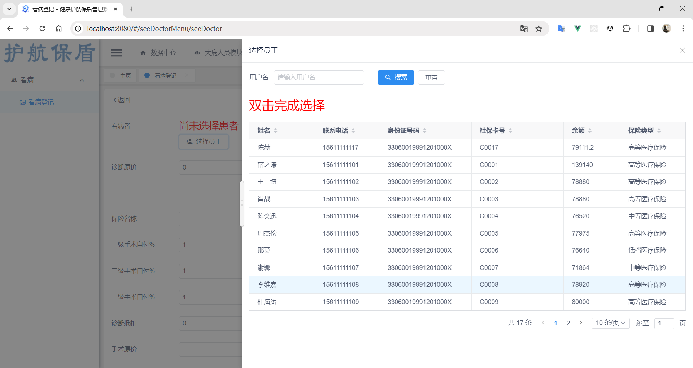

点击“选择手术”，可以选择需要导入档案的手术信息，点击手术并输入数量，选择“暂存”，“从手术档案导入”，即可添加手术。

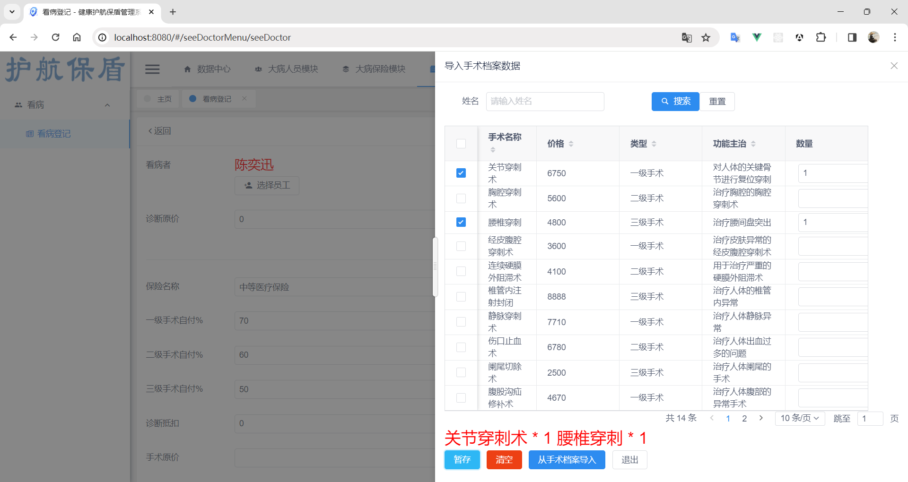

门诊类型根据设置来对不同的门诊类型进行选择，对应不同的自付比例，如下图所示。

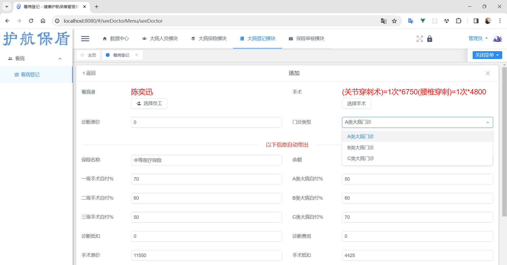

输入“诊断原价”，例如输入“ 6000 ”，系统根据所选择的门诊类型的不同，计算不同的报销比，自动计算报销后的费用总计“10125”，最后点击“提交与保存”即可完成看病的档案登记。

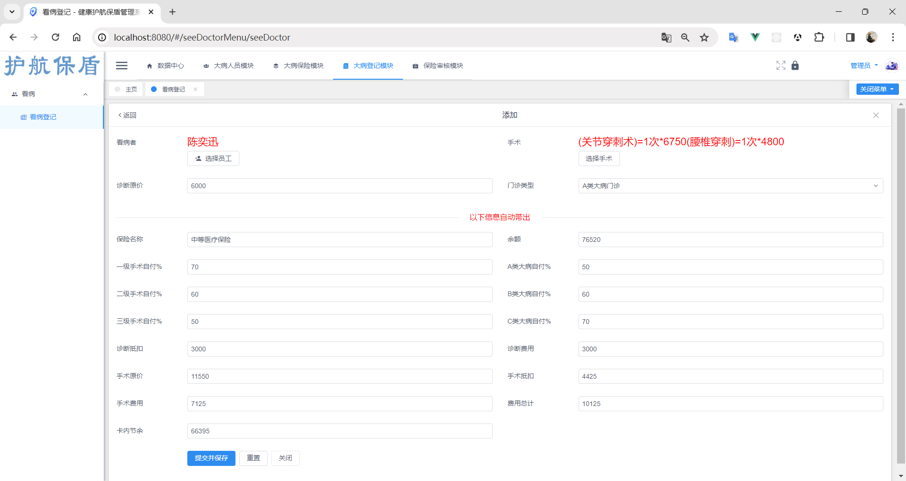

### 保险审核模块

保险审核模块是相关工作人员对参保人员提出的大病保险相关的审核，所以该部分的功能主要是对参保人的保险审核。该部分同样包括了对参保人员的基础查找功能，该部分的最主要的功能是为了方便保险管理人员对参保人提出的保险抵扣进行审核，所以该部分为了便于相关保险工作者进行高效审核，在查找部分的时候，可以直接查找审核状态，提高审核的工作效率。在审核参保人员的信息准去无误后，相关保险工作者可以直接点击审核通过或选择不通过，并同时批注上不通过的理由。

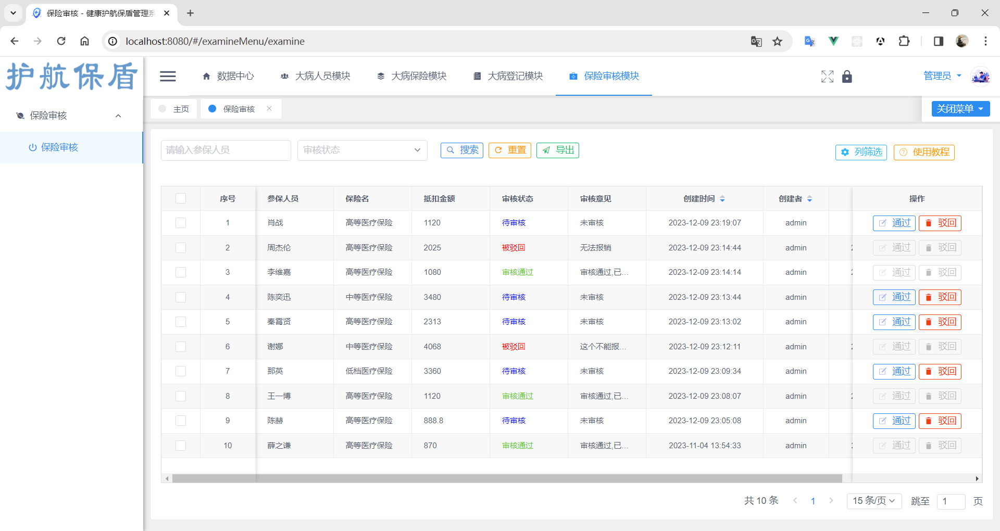

如果保险审核员对于申请的医保报销无法进行通过，则可以点击“驳回”，输入退回的原因：该病不予报销，点击“确定”，则可以退回申请。

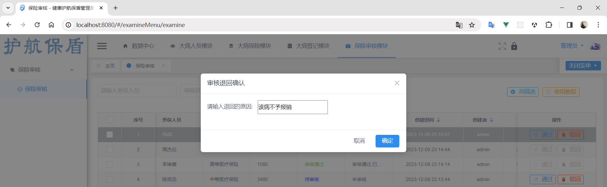

如果某个医保保险申请符合要求，则可以审核通过，点击“通过”按钮，再点击“确认”即可。

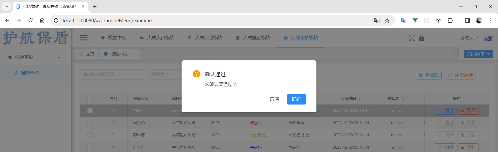

审核后，系统将自动保存审核意见至数据库，以备核验。
